**网页的三大要素：
css:定义网页的样式、
HTML：定义网页的结构和信息、
JavaScript：定义用户和网页的交互逻辑**
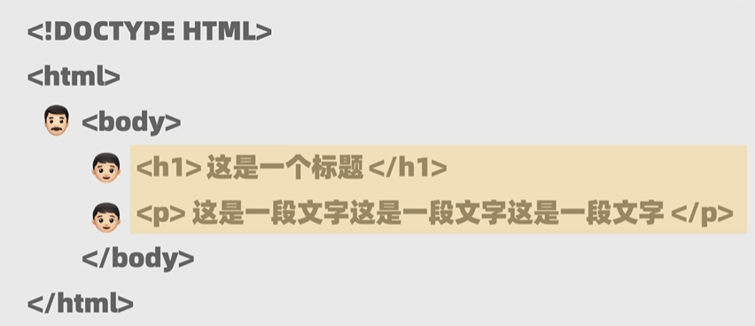
$\Rightarrow$产生以下网页
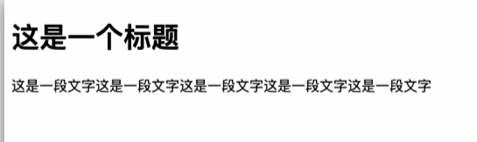
### 标题标签
==可以通过css调整字号==
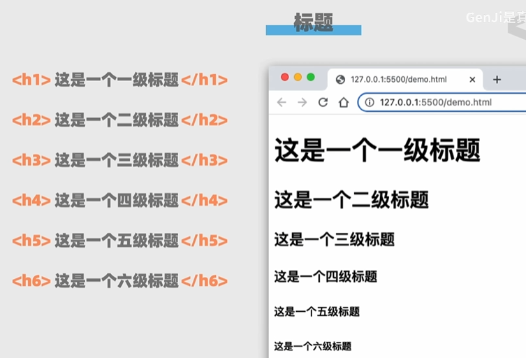
### 文本标签
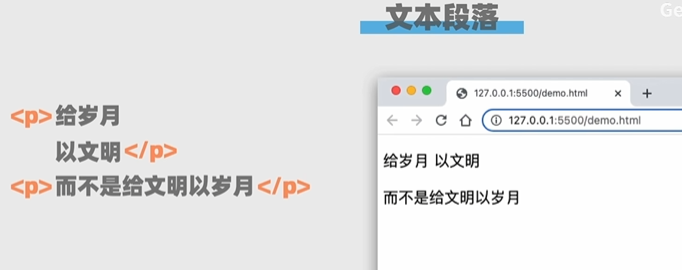
#### 换行标签：\ 
#### 加粗标签：\<b>和\</b>
#### 斜体标签：\<i>和\</i>
#### 加下划线：\<u>和\</u>
#### 图片标签：\
#### 链接：\<a href="跳转链接的地址" ==target="_self"当前窗口==  或者==target="_blank"新窗口==>我的主页\</a>
#### 容器：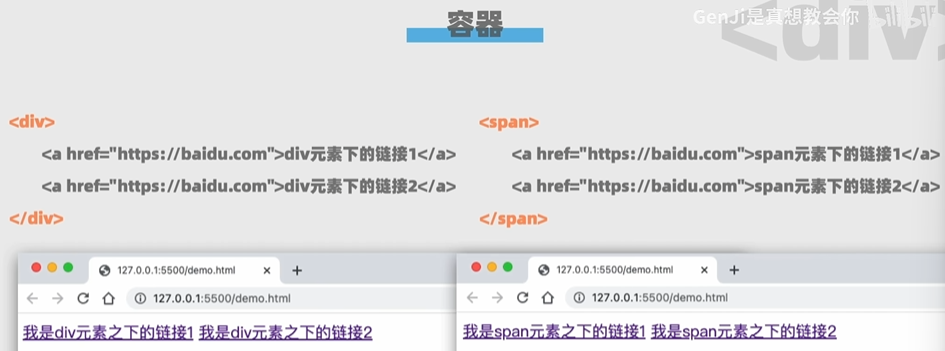
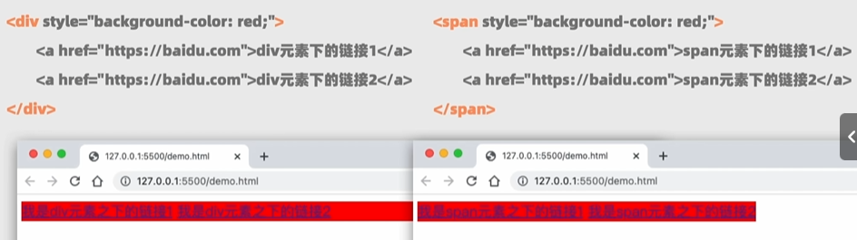
div是块级元素，一行最多放一个div元素
span是内联元素，一行可以放多个
#### 列表：
#### 有序列表\<ol>与\</ol>  
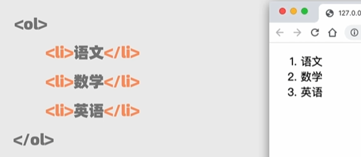
#### 无序列表\<ul>与\</ul>
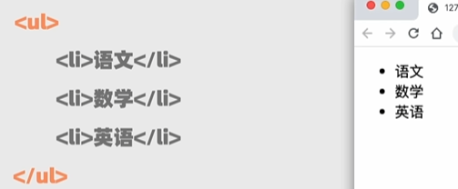
#### 表格：
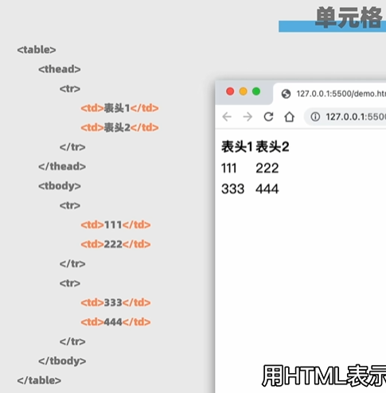
通过加\<table border="1">来增加边框
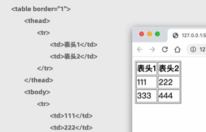

#### class属性：区分哪些是文本，哪些是评论
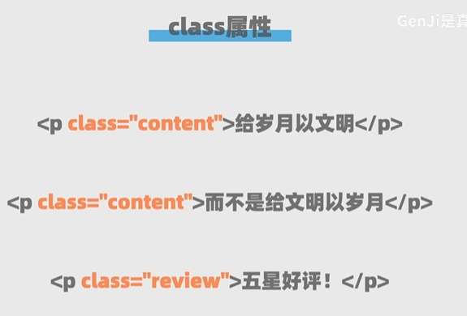
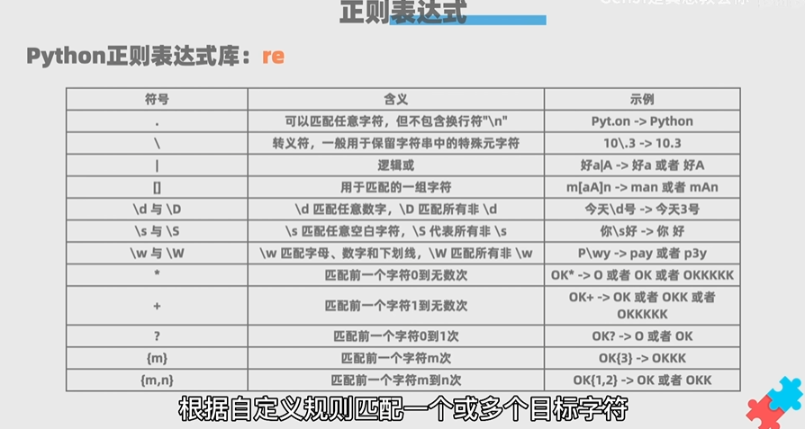
多线程